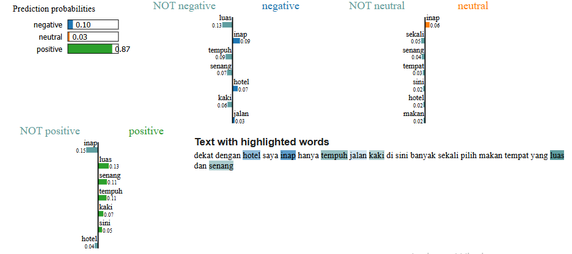
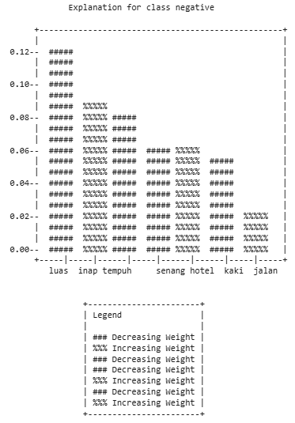

# lime_to_ascii Repository
by Jusuf Junior Athala  
Using mpl_ascii library to convert matplotlib figure of LIME Explanations into ASCII plot. ASCII plot will be able to be inserted into CSV file.

### Warning
1. used older mpl_ascii version == 0.10.0.  
2. Can only convert matplotlib figure resulted from as_pyplot_figure function from LIME Explanations Class Object

## GetLimeResults.ipynb  
1. Read NusaX Dataset - Sentiment Analysis. Class labels : negative, neutral, positive.
2. Use Model Naive Bayes 
3. Get LIME Explanation for each predictions
4. Save LIME Explanation Objects into Pandas Dataframe
5. Save Dataframe into Pickle File

## LIMEObjectToASCII.ipynb
1. Read Pickle File
2. Read LIME Explanation Objects from Pandas Dataframe
3. Use mpl_ascii library to convert LIME Object to ASCII plot
4. Save ASCII Plot into Pandas Dataframe
5. Save Dataframe into CSV file

